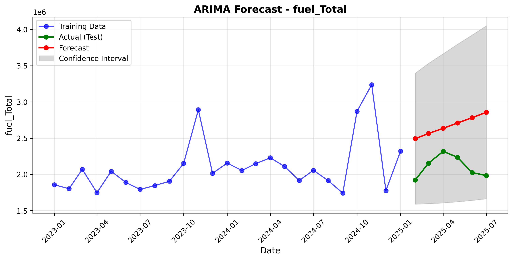
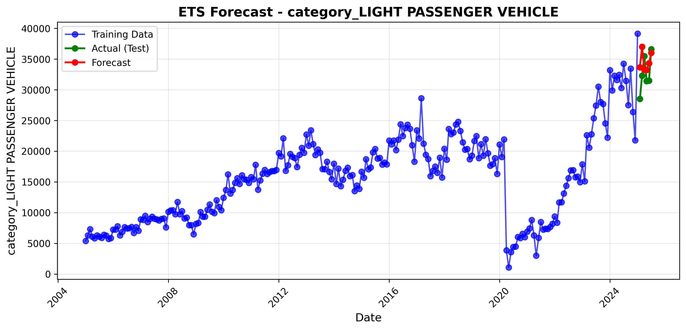
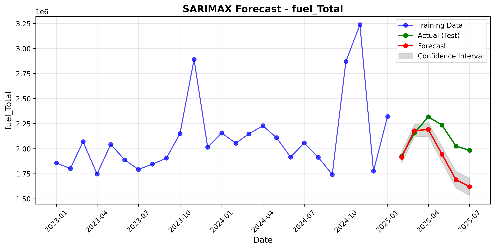
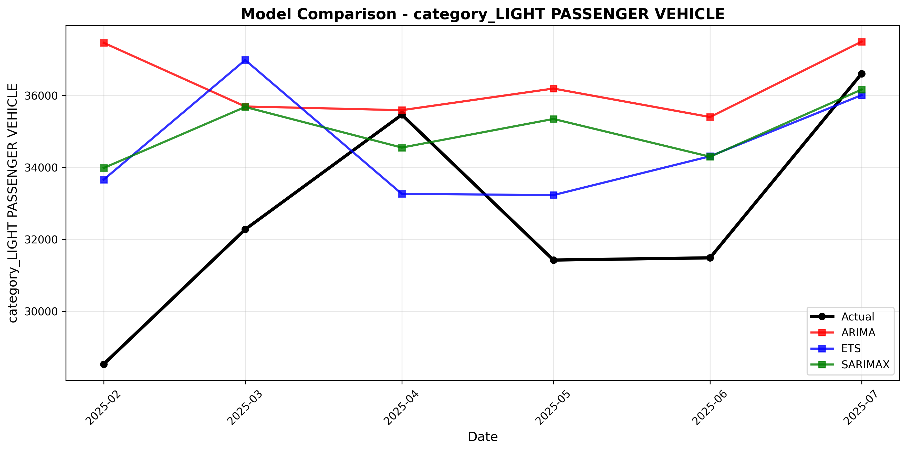
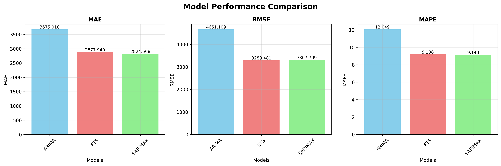
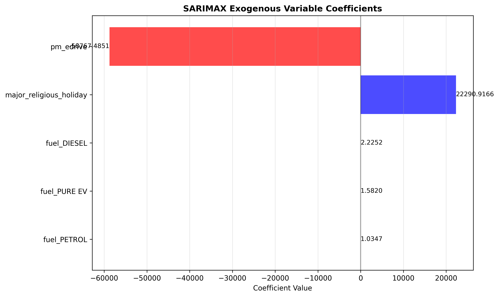

# Vehicle Sales Forecasting System Documentation

## Project Overview

This project implements a comprehensive forecasting system for vehicle sales in India. The system uses time series analysis and causal forecasting techniques to predict future vehicle sales based on historical data and exogenous variables like economic indicators, holidays, and automotive policy changes.

The forecasting pipeline includes:
- Data loading and preprocessing
- Multiple forecasting models (ARIMA, ETS, SARIMAX)
- Model evaluation and comparison
- Visualization dashboard for insights

## Dataset Information

The dataset combines multiple data sources for a comprehensive analysis:

### Vehicle Sales Data
- **Source**: Government portal https://analytics.parivahan.gov.in/analytics/vahanpublicreport
- **Timeframe**: 2023 to 2025
- **Categorization**: Data sorted by fuel type, vehicle category, and vehicle class

### Supporting Data Sources
- **Fuel Prices**: Government international prices of crude oil (Indian basket)
- **Interest Rates**: Long-Term Government Bond Yields (10-Year Benchmark for India)
- **Holidays**: Generated using Python 'holidays' library
- **Automotive Policies**: Includes flags for:
  - FAME II/III schemes
  - PM e-Drive initiative
  - BS7 norms
  - Bharat NCAP
  - Vehicle scrappage policy
  - PLI scheme
  - Repo rate information

## Setup Instructions

### 1. Set Up Virtual Environment

```bash
# Create a new virtual environment
python -m venv venv

# Activate the environment
# On Windows:
venv\Scripts\activate
# On macOS/Linux:
source venv/bin/activate
```

### 2. Install Dependencies

```bash
# Install required packages
pip install pandas numpy matplotlib statsmodels scikit-learn pmdarima

# If pmdarima installation fails, try:
pip install --upgrade --force-reinstall pmdarima numpy
```

### 3. Project Structure

```
salesforce/
├── Code/
│   ├── main_pipeline.py      # Main execution script
│   ├── data_loader.py        # Data loading utilities
│   ├── baseline_models.py    # ARIMA and ETS models
│   ├── causal_models.py      # SARIMAX with exogenous variables
│   ├── model_utils.py        # Metrics and utilities
│   ├── visualization.py      # Plotting functions
│   ├── config.py             # Configuration settings
│   └── forecast_results/     # Output directory
├── dataset/
│   ├── final_merged_dataset.csv  # Main dataset file
│   ├── combined_data.csv         # Supporting data
│   ├── joined_data.csv           # Vehicle sales data
│   └── sources.txt               # Data source information
└── documentation.md         # This documentation file
```

### 4. Running the Forecasting Pipeline

```bash
# Navigate to the Code directory
cd salesforce/Code

# Run the main pipeline
python main_pipeline.py
```

The pipeline will:
1. Load and preprocess the dataset
2. Split data into training and testing sets
3. Train baseline models (ARIMA, ETS)
4. Train causal model (SARIMAX) with exogenous variables
5. Generate forecasts and evaluate model performance
6. Create visualizations and save results

## Generated Visualizations

The forecasting pipeline generates several visualizations saved to the `forecast_results/visualizations/` directory:

### 1. Model Forecasts

Individual forecast plots for each model showing:
- Training data (blue)
- Actual test data (green)
- Forecast predictions (red)
- Confidence intervals (gray shaded area, where applicable)

#### ARIMA Forecast


#### ETS Forecast


#### SARIMAX Forecast


### 2. Model Comparison

Combined plot showing forecasts from all models against the actual values, allowing visual comparison of model performance.



### 3. Metrics Comparison

Bar charts comparing key performance metrics across models:
- **MAE** (Mean Absolute Error): Average absolute difference between predictions and actual values
- **RMSE** (Root Mean Square Error): Square root of the average of squared differences
- **MAPE** (Mean Absolute Percentage Error): Percentage representation of error



### 4. SARIMAX Coefficients Plot

Horizontal bar chart showing the impact of exogenous variables on the forecast, with:
- Blue bars for positive coefficients (increasing effect)
- Red bars for negative coefficients (decreasing effect)



## Current Results

Based on the generated metrics in `forecast_metrics.csv`, the SARIMAX model outperforms the baseline models with:
- **MAE**: 191,619
- **RMSE**: 240,479
- **MAPE**: 9.16%

Here's a table showing the comparison of all model performance metrics:

| Model   | MAE     | RMSE    | MAPE   |
|---------|---------|---------|--------|
| ARIMA   | 566,630 | 598,919 | 27.48% |
| ETS     | 239,096 | 256,084 | 11.65% |
| SARIMAX | 191,619 | 240,479 | 9.16%  |

The model forecasts show predictions for vehicle sales from February 2025 to July 2025, with SARIMAX capturing the seasonal patterns more accurately than the baseline models.

## Model Predictions

The forecast predictions for the next 6 months (Feb 2025 - Jul 2025) are as follows:

| Month      | ARIMA    | ETS      | SARIMAX  | Actual   |
|------------|----------|----------|----------|----------|
| 2025-02-01 | 2,493,234| 2,275,124| 1,914,566| 1,923,300|
| 2025-03-01 | 2,564,247| 2,445,848| 2,179,117| 2,155,581|
| 2025-04-01 | 2,636,134| 2,396,638| 2,192,235| 2,317,806|
| 2025-05-01 | 2,708,896| 2,414,449| 1,944,405| 2,236,406|
| 2025-06-01 | 2,782,531| 2,248,181| 1,689,899| 2,025,568|
| 2025-07-01 | 2,857,041| 2,296,645| 1,619,442| 1,983,645|

## Troubleshooting

### Empty Plots
If the metrics comparison plot appears empty:
- Ensure the metrics CSV file has the correct format
- Check if metrics are calculated correctly in the code
- Verify that the visualization.py file is properly handling the dataframe orientation

### Model Failures
If any models fail to train:
- Check for NaN values in your dataset
- Ensure there's sufficient historical data (at least 12 months recommended)
- Try adjusting model parameters in config.py

### pmdarima Installation Issues
If you encounter issues with pmdarima:
```bash
# Try reinstalling with specific versions
pip install --upgrade --force-reinstall pmdarima==1.8.5 numpy==1.20.3
```

## Flask API Server

A REST API server has been created to serve the forecasting model outputs. The API provides JSON endpoints for accessing predictions, metrics, and model comparisons.

### API Endpoints

- **GET** `/health` - Health check
- **GET** `/api/v1/predictions` - All model predictions with actual values
- **GET** `/api/v1/metrics` - Model performance metrics (MAE, RMSE, MAPE)
- **GET** `/api/v1/models` - Information about available models
- **GET** `/api/v1/forecast/{model_name}` - Specific model forecast (ARIMA, ETS, SARIMAX)
- **GET** `/api/v1/comparison` - Model comparison and rankings

### Setting up the API Server

#### Option 1: Automated Setup (Windows)
```powershell
# Run the PowerShell setup script
.\setup_api.ps1
```

#### Option 2: Manual Setup
```bash
# Install API dependencies
pip install -r requirements_api.txt

# Ensure forecast data exists (run if needed)
cd Code
python main_pipeline.py

# Start the API server
python app.py
```

The API server runs on `http://localhost:5000` with CORS support enabled.

### Testing the API

Use the provided demo script to test all endpoints:
```bash
cd Code
python api_demo.py
```

Or test individual endpoints with curl:
```bash
# Health check
curl http://localhost:5000/health

# Get all predictions
curl http://localhost:5000/api/v1/predictions

# Get SARIMAX forecast
curl http://localhost:5000/api/v1/forecast/SARIMAX
```

### API Documentation

Detailed API documentation with request/response examples is available in `API_Documentation.md`.

## Next Steps

To improve the forecasting system:
1. Add more exogenous variables related to economic factors
2. Implement ensemble methods combining multiple model predictions
3. Create interactive dashboards using Plotly or Dash
4. Add more advanced models like Prophet or LSTM neural networks
5. Enhance the API with authentication and rate limiting for production use
6. Add real-time data ingestion capabilities
